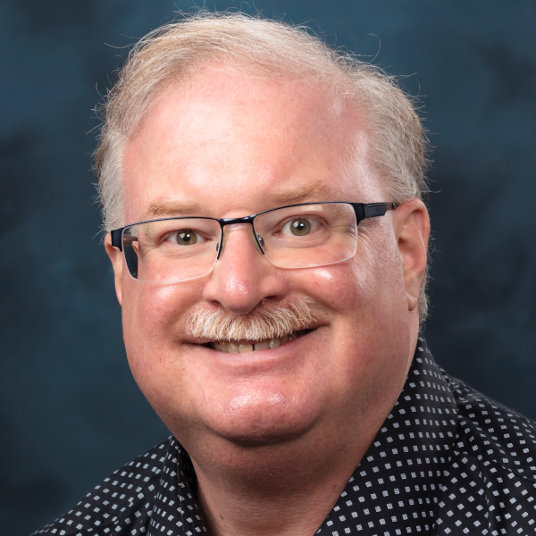

David Bernholdt is a Distinguished R&D Staff Member at Oak Ridge National Laboratory.  His research interests are in the programming of high-performance computers, broadly interpreted, but with a particular focus on computational science and engineering applications.  Part of that work has involved working to improve awareness and practice of software engineering and software productivity, sustainability, and trustworthiness through the0 [IDEAS](https://ideas-productivity.org/) family of projects, and more recently the Chair of the [Consortium for the Advancement of Scientific Software](https://cass.community/) (CASS). He has worked closely with the fusion energy community for more than 20 years through multiple partnerships in the US DOE’s Scientific Discovery through Advanced Computing (SciDAC) program and other projects.
---
