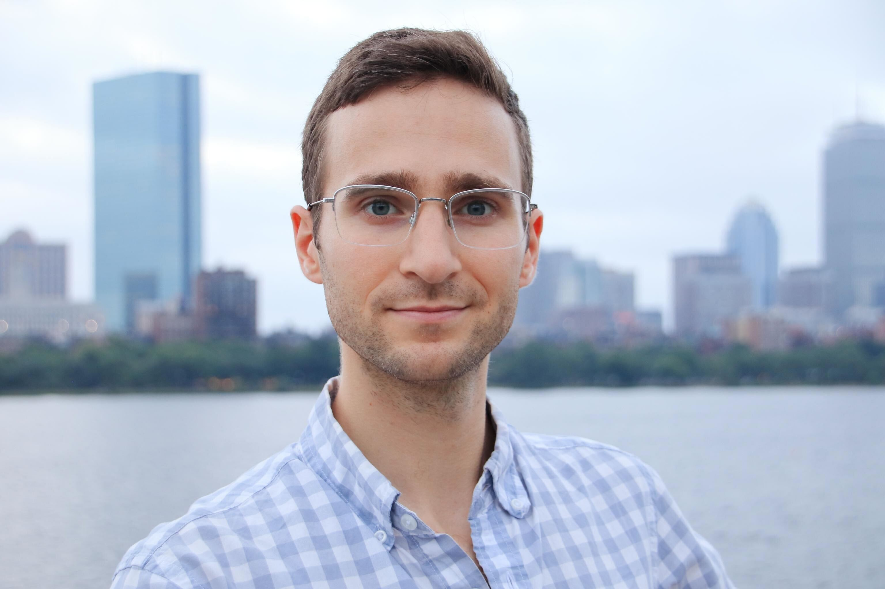

At Commonwealth Fusion Systems, Matt Vernacchia leads the Scientific Software team, which develops internal and open-source software to help understand and build superconducting magnets and tokamaks. The team's data analysis, simulation, and optimization tools are vital to magnet design, manufacturing, and testing, as well as tokamak design and planning. The team develops in Python, TypeScript, Rust, and C++, with an emphasis on code quality and maintainability. Matt enjoys supporting an effective team and supporting the energy transition. Prior to joining CFS in 2020, Matt received a PhD in Aeronautics and Astronautics from MIT.

---
