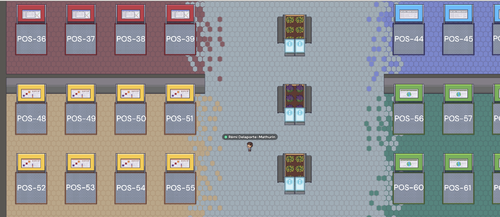
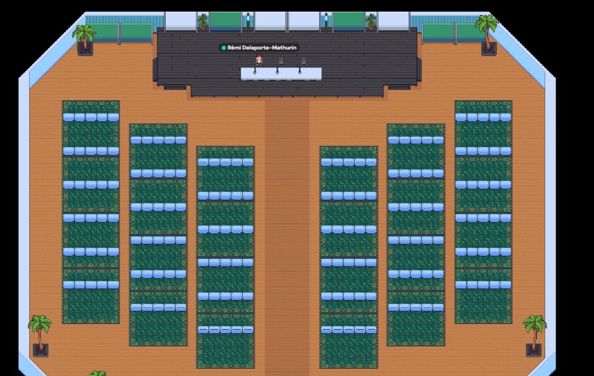

# Join the Even
Please visit our Gather Town event landing page to join the event: [Gather Town Event](https://app.gather.town/events/TUHZmJy7THyTSP8i-wnq)

If you registered for the event, you should be able to access the event using the email address you used to register. Don't hesitate to try it out before the event starts!

For more information on how to navigate the event, follow the [Gather Town Guide](https://www.gather.town/blog/guide-getting-started)

If you have any issues accessing the event, please contact us at ossfe2025@gmail.com.

# Instructions for Poster Presenters
Please ensure your posters are uploaded via the [Poster Upload Form](https://docs.google.com/forms/d/e/1FAIpQLSf5_5PSGzNpqzf3_94BiCKq6oCzspHyRRpwkgmHTe9oflFH0Q/viewform?usp=header) by the deadline.

 - Posters can be uploaded as a PDF or image file.
 - Please ensure your poster is legible and clearly conveys your research.
 - Attendees will be interacting with your poster via Gather Town, therefore the format is flexible (landscape, portrait etc.).
 - You will have a dedicated time slot to present your poster and interact with attendees.
 - Here is a preview of what the poster room looks like. Each poster square is a "private zone" where presenters can chat with attendees. You will also have the option to share your screen for additional content.

# Instructions for Speakers
 - Presenters will display their presentations via screen sharing.
 - Session chairs will spotlight speakers so that everyone in the room can hear them and see their slides.
 - Non-plenary talks will be 20 min long, including Q&A.
 - Plenary talks will be 30 min long, including Q&A.
 - Make sure to test your audio and video setup before your session.
 - Join the session 10 minutes early to ensure everything is working smoothly.
 - Here is a preview of the talk room. Each row of seats is a "private zone" meaning that only people sitting on the row can hear you.

